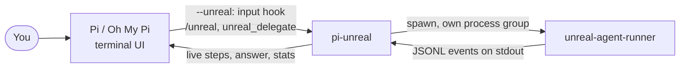

# pi-unreal

**Swap the brain of Pi for [Unreal Agent](https://github.com/unreallabsai/unreal-agent), keep the terminal you already use.**

<p align="center">
  
</p>

<p align="center">
  <a href="https://github.com/pandodavinci/pi-unreal/actions/workflows/ci.yml"></a>
  <a href="LICENSE"></a>
  
</p>

<p align="center">
  
  
  
  
  
  
</p>

## Features

- **Unreal as the harness.** Start Pi with `--unreal` and every message you type goes to Unreal Agent instead of Pi's model. `/harness pi` hands the chat back to Pi, and Unreal is caught up on what it missed when you switch again.
- **Unreal as a background worker.** `/unreal fix the failing tests` runs in the background while you keep chatting. Progress shows above the editor, the result lands in the chat.
- **One plugin, two hosts.** The same package installs into [Pi](https://github.com/badlogic/pi-mono) and [Oh My Pi](https://github.com/can1357/oh-my-pi).
- **Real cancellation.** Esc stops Unreal and the commands it started, including ones that ignore Ctrl-C (see [Limitations](#limitations) for the edge case).
- **Safer in other people's repos.** Unreal loads a project's `.env`, which lets a repo steal your API key or run code in every shell command ([unreal-agent#5](https://github.com/unreallabsai/unreal-agent/issues/5)). pi-unreal neutralizes the `.env`, and tests run these attacks against the real runner.
- **Zero setup for Unreal itself.** The official runner is downloaded on first use and checked against its published SHA-256.

## Install

**Prerequisites**

- [Pi](https://github.com/badlogic/pi-mono) or [Oh My Pi](https://github.com/can1357/oh-my-pi)
- macOS or Linux (x64 or arm64). Unreal publishes no Windows runner.
- Model access for Unreal. The default is your Codex login (`codex login`, stored in `~/.codex/auth.json`). API keys work too, see [Configuration](#configuration).

**Pi**

```sh
pi install git:github.com/pandodavinci/pi-unreal
```

> [!NOTE]
> If you configured a custom `npmCommand` in Pi 0.87.1, git installs also pull in development dependencies. The plugin still works; it is just a larger install.

**Oh My Pi**

```sh
omp plugin install github:pandodavinci/pi-unreal
```

## Quick start

Open any project and let Unreal answer every message:

```sh
cd my-project
pi --unreal            # Oh My Pi: omp --unreal
```

```text
run the tests, investigate the failures, and fix them
```

Unreal's steps stream above the editor, then the answer lands in the chat with its time, model calls, tool calls and tokens. Press **Esc** to stop it, **Ctrl+O** to see every step.

**Advanced: keep Pi, hand one task to Unreal**

```text
/unreal run the full test suite and fix what fails
```

Pi stays interactive. `/unreal-jobs` shows progress, `/unreal-cancel` stops the job. Pi's own model can do the same through the `unreal_delegate` tool.

## Usage

| In `--unreal` mode | |
| --- | --- |
| Type a message | Unreal answers. It remembers the conversation, and is caught up on anything it missed: messages Pi handled, background results, or a forked chat's history (the last 12,000 characters). Going back with `/tree` or forking starts a fresh Unreal session for that branch. |
| Paste an image (Ctrl+V) | Unreal opens it with its ViewImage tool. |
| Type while it works | Messages queue and run in order. Esc stops the current one and drops the queue. |
| `/harness pi`, `/harness unreal` | Switch who answers, in the same chat. Refused while the other side is still working. |

Slash commands and `!bash` always go to Pi. A prompt on the command line goes to Unreal too: with released Pi 0.87.1, put it before the flag (`pi "fix the tests" --unreal`), since Pi's parser otherwise reads it as the flag's value; Oh My Pi checks its own model login before handing that first prompt over, so without one, type the prompt in the chat instead.

| Mode | `--unreal` | `/unreal`, `unreal_delegate` |
| --- | --- | --- |
| Interactive terminal (Pi, Oh My Pi) | yes | yes |
| Pi RPC | yes | yes |
| Oh My Pi RPC and ACP | off, with a warning (fix pending upstream: [oh-my-pi#11834](https://github.com/can1357/oh-my-pi/pull/11834)) | yes; results also go to stderr, and in RPC to a notification ([oh-my-pi#12718](https://github.com/can1357/oh-my-pi/pull/12718)) |
| Print (`-p`) and JSON | off, with a warning on stderr | `/unreal` waits and prints the result; the tool always runs in the foreground |

In print mode, run `/unreal` in a fresh session (`--no-session`): when resuming a chat the host also prints its own last answer afterwards. Pi exits with code 1 when the job failed; Oh My Pi's print mode always exits 0.

| Background commands | |
| --- | --- |
| `/unreal <task>` | Start a background job. |
| `/unreal-jobs` | List jobs; pick one to show its full result in the chat. |
| `/unreal-cancel [id\|all]` | Stop a job (default: the most recent). |

### How it works



In `--unreal` mode the messages you type are handled before they reach Pi's agent loop, and pi-unreal never wakes Pi's model. Slash commands and other extensions can still start Pi turns. Unreal's persisted session continues as long as the chat does; a fork, a different branch or an interrupted turn starts a new one, seeded with the visible history.

### Configuration

| Variable | Default | |
| --- | --- | --- |
| `UNREAL_HARNESS_LLM_PROVIDER` | `openai-codex` | `openai`, `openai-codex`, `openrouter`, `fireworks`, `ollama` |
| `UNREAL_HARNESS_LLM_MODEL` | `gpt-6-astra` with openai-codex | Model ID |
| `OPENAI_API_KEY`, `OPENROUTER_API_KEY`, `FIREWORKS_API_KEY` | | Key for the chosen provider |
| `UNREAL_AGENT_RUNNER` | downloaded release | Use your own `unreal-agent-runner` build |
| `PI_UNREAL_MODE=1` | off | Same as `--unreal` |
| `PI_UNREAL_THINKING` | runner default (`high`) | `low`, `medium`, `high`, `xhigh`, `max` |
| `PI_UNREAL_STATE_DIR` | `~/.cache/pi-unreal` | Runner download, sessions, logs, pasted images. Run logs and job output are removed after 14 days; Unreal sessions, their command output and pasted images after 60 days without use. |
| `PI_UNREAL_TRUST_DOTENV=1` | off | Let a trusted project's `.env` reach Unreal (model credentials, endpoints and proxies stay pinned) |
| `PI_UNREAL_DEBUG=1` | off | Write every runner event to `<state>/debug.log` (private file) |

Set these in your shell, not in a project's `.env`: by default pi-unreal neutralizes every variable a project's `.env` defines.

> [!NOTE]
> **Streaming.** Released Unreal runners (v0.1.1) accept `include_partial_messages` but ignore it, so each reply appears when it is complete while the step list updates live. pi-unreal already requests streaming and shows replies word by word with any runner that implements it. An implementation is proposed upstream in [unreal-agent#10](https://github.com/unreallabsai/unreal-agent/issues/10); to try it now, build [that branch](https://github.com/pandodavinci/unreal-agent/tree/partial-messages) and set `UNREAL_AGENT_RUNNER`.

> [!WARNING]
> Unreal Agent runs shell commands in your project with your permissions, like any coding agent. pi-unreal neutralizes a repo's `.env`, but a malicious repo can still try to steer the agent through its files. Details in [SECURITY.md](SECURITY.md).

### Limitations

- Unreal uses its own tools (Bash, ViewImage, skills in `.harness/skills`). Pi's tools, skills and MCP servers are not available to it.
- Commands are tracked by polling Unreal's process tree 4 times a second. A command started and orphaned by Unreal in the instant before it exits (on a crash, or while stopping) can survive cleanup.
- Tested by hand on Pi 0.87.1 and Oh My Pi 18.2.8 to 18.2.11 (macOS arm64). CI runs the test suite on macOS and Linux, loads the plugin on Node, and drives the real `pi` and `omp` binaries end to end.

## Contributing

Issues and pull requests are welcome. Before opening a PR:

```sh
bun install
bun run check     # typecheck
bun test          # includes live attack tests against the real Unreal runner; PI_UNREAL_SKIP_LIVE=1 skips them
bun run smoke:node  # loads the plugin on Node the way Pi does
bun run e2e         # drives the real `pi` binary in RPC mode (e2e:omp needs `omp` on PATH)
```

Try local changes with `pi -e ./src/index.ts --unreal`. Code in `src/` must stay Node-compatible, since Pi runs extensions on Node.

## License

[MIT](LICENSE). Unreal Agent is MIT licensed by Unreal Labs.
